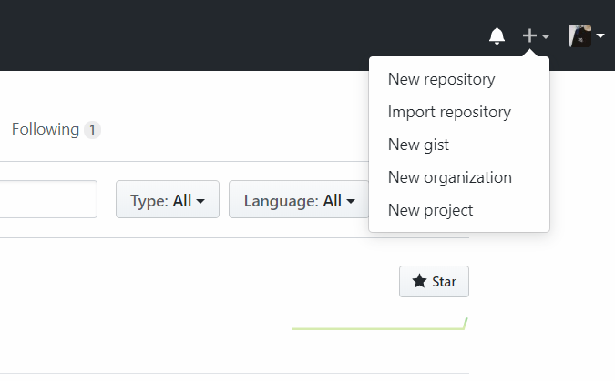
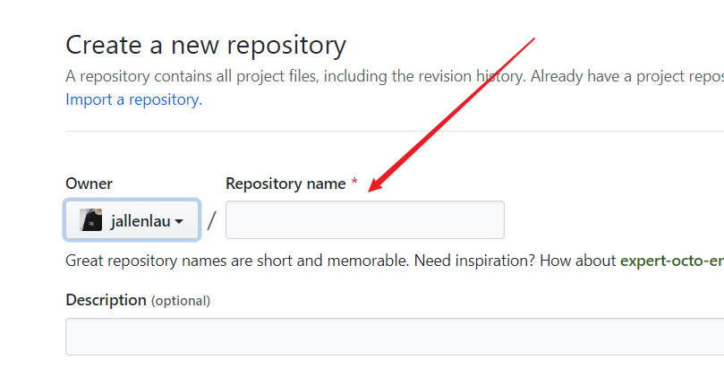
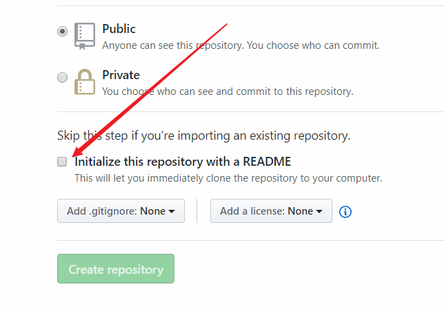
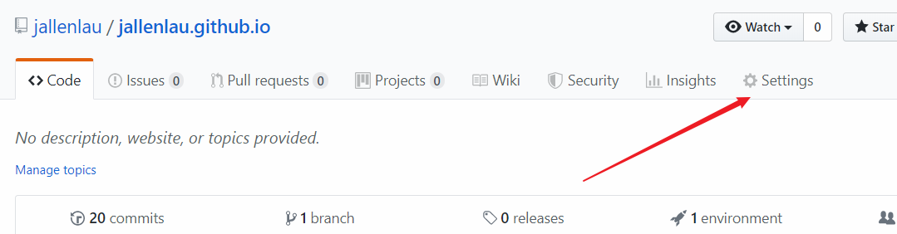
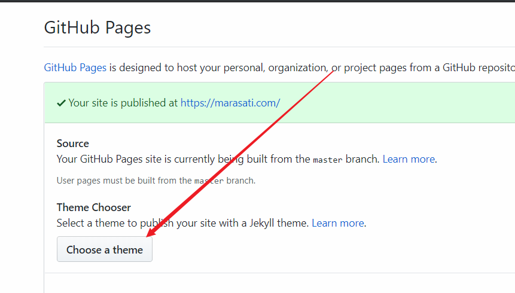

# 创建 GitHub Pages & 自定域名教程

本文详细介绍利用 Github Pages 搭建个人博客，以及自定义域名步骤。

<!--more-->

## 建立 GitHub Pages
### 第一步
建立 [GitHub](www.github.com) 账户
### 第二步
#### 首先
进入主页点击右上角 + 号，建立 New Repository。

#### 其次
Repository name 填写 `username.github.io`，此处注意 `username` 部分一定需要与你的用户名相同。

#### 最后
勾选 Initialize this repository with a README，然后点击 Create repository。

### 第三步
#### 首先
进入建立完成的项目主页，点击右上角的 Settings。

#### 其次
找到 GitHub Pages，点击 Choose theme 选择一个主题后点击确认，选择完毕之后  GitHub Pages 就会自动帮你生成好网站，在他跳转的界面点击 Commit changes 按钮，网站就可以访问了。

#### 最后
在浏览器内直接输入 `username.github.io`，如果成功打开页面即成功完成 Pages 的建立。

## 自定域名
### 第一步
自行购买一个域名，如本人在 Google 购买的域名 `marasati.com`。
### 第二步
#### 域名为 `username.com`类的根域名
打开域名供应商网站,将自定 DNS 资源处增加记录。
打开 Linux，运行代码 `ping username.github.io` 得到 IP 地址并将其复制。
增加两条记录：
>- 名称默认 @，类型 A，TTL 输入600（10m），IPv4地址填写刚刚复制的 IP 地址
>- 名称 www，类型 CNAME，TTL 输入600（10m），IPv4地址填写 `username.github.io`

#### 域名为 `grus.myou.life` 类的子域名
打开域名供应商网站,将自定 DNS 资源处增加两条记录：
>- 名称 grus，类型 CNAME，TTL 输入600（10m），IPv4地址填写 `username.github.io`
>- 名称 www，类型 CNAME，TTL 输入600（10m），IPv4地址填写 `username.github.io`
### 第三步
回到 GitHub 所建项目的 Settings，下滑找到 Github Pages，在 Custom domain 内填入购买的域名后点击 Save，下方 enforce https 是否勾选自行选择。
### 建立完成

